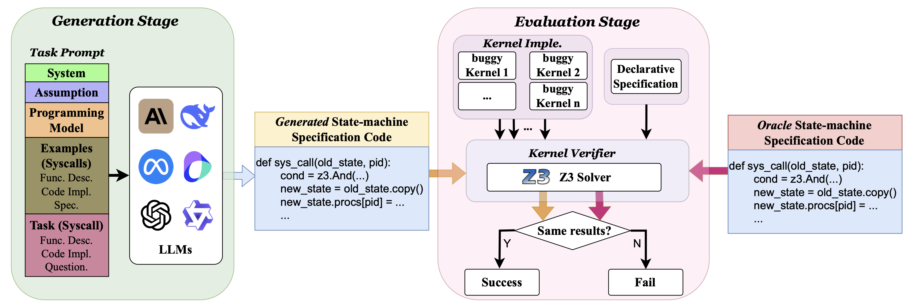

# OSVBench: Benchmarking LLMs on Specification Generation Tasks for Operating System Verification

[](https://github.com/juyongjiang/CodeUp/blob/master/LICENSE)
[](https://github.com/juyongjiang/CodeUp/blob/master/data/DATA_LICENSE)
[](https://www.python.org/downloads/release/python-390/)
[](https://github.com/psf/black)

## Table of Contents
- [Overview](#overview)
- [Environment Setup](#environment-setup)
- [Benchmark](#benchmark)
- [Prompt Template](#prompt-template)
- [Evaluation](#evaluation)
- [License](#license)
- [Citation](#citation)

## Overview
We introduce OSVBench, a new benchmark for evaluating Large Language Models (LLMs) in generating complete specification code pertaining to operating system kernel verification tasks. The benchmark first defines the specification generation problem into a program synthesis problem within a confined scope of syntax and semantics by providing LLMs with the programming model. The LLMs are required to understand the provided verification assumption and the potential syntax and semantics space to search for, then generate the complete specification for the potentially buggy operating system code implementation under the guidance of the high-level functional description of the operating system. This benchmark is built upon a real-world operating system kernel, Hyperkernel, and consists of 245 complex specification generation tasks in total, each is a long context task of about 20k-30k tokens. Our comprehensive evaluation of 12 LLMs exhibits the limited performance of the current LLMs on the specification generation tasks for operating system verification. Significant disparities of their performance on the benchmark,differentiating the ability on long context code generation tasks.



- Authors: Shangyu Li, Juyong Jiang, Tiancheng Zhao, Jiasi Shen
- Paper: [https://arxiv.org/abs/2504.20964](https://arxiv.org/abs/2504.20964)

## Environment Setup

Python version: >= 3.8

Docker CE version: 27.3.1

```bash
conda create -n osvbench python=3.12
conda activate osvbench
conda install openai
```

## Benchmark

The benchmark locates at `./bench_prompts/benchmark.json`.

The data format is:

```json
[
{
    "syscall": "syscall name",
    "declaration": "syscall declaration",
    "description": "\n[Functional Description]: ... ",
    "code": "[Code Implementation]: ... ",
    "bug_type": "bug type",
    "bug_num": "bug number"
},
...
]
```

## Prompt Template

The prompt is composed of five sections: the system prompt, verification assumption, programming model, few-shot examples, and the task question. The system prompt, verification assumption, and programming model are located in `./bench_prompts/system_assumption_model`.
The few-shot examples are provided in the files `./bench_prompts/1_shot_example`, `./bench_prompts/3_shots_examples`, `./bench_prompts/5_shots_examples`, .`/bench_prompts/7_shots_examples`, and `./bench_prompts/9_shots_examples`. The task Spec combines these sections with the task question to construct the final prompt.

A complete prompt example using the 5-shot configuration is available at `./FULL_PROMPT_EXAMPLE_5_SHOTS`.


## Evaluation

Run the following commands to evaluate a model on the benchmark.

**1. Obtain the state-machine specification generated by the LLM through API invocations.**
```bash
bash ./run_benchmark.sh
```
Or:

```bash
python LLM_API_Invocations_passk.py \
--llm {gpt4om} \
--task {Spec} \
--problem_num {245} \
--resume {true} \
--results {Spec} \
--sleep {5} \
--example {5_shots_examples} \
--data {benchmark.json} \
--restart {N1} \
--end {N2} \
--task_number {N3} \
--pass_n {1}
```

**Key Parameters**:
- `--llm`: Model shortname (e.g., `gpt4o`, `claude3sonnot`, `llama8b`).
- `--task`: Specification generation task (default: `Spec`).
- `--problem_num`: Number of tasks to evaluate (default: 245).
- `--resume`: Resume from the last evaluation.
- `--sleep`: API call cooldown (default: 5s).
- `--example`: Few shots examples file (default: 5_shots_examples).
- `--data`: Benchmark file (default: benchmark.json).
- `--restart`: Task number in the benchmark file to restart (e.g. 0-244).
- `--end`: Task number in the benchmark file to end (e.g. 0- 244).
- `--task_number`: Invoke API for single task (e.g. 0-244).
- `--pass_n`: Pass n number (e.g. 1-5).

Example: `python LLM_API_Invocations_passk.py --task Spec --example 5_shots_examples --data benchmark.json --problem_num 245 --results Spec --llm claude3sonnet --pass_n 1 --sleep 0`

Upon successful completion, the generated state-machine specifications will be saved in the `./results/Spec/claude3sonnet_Spec.json` file.

**2. Using the LLM generated state-machine specification to verify the functional correctness of Hyperkernel.**

```bash
bash ./run_spec_check.sh {specification file name}
```

Example: To use the file `./results/Spec/claude3sonnet_Spec.json`, run the command:
`bash ./run_spec_chech.sh claude3sonnet_Spec` (without `.json`)

Upon completion, the verification results will be stored in the `./outputs` directory (e.g., `./outputs/output_claude3sonnet_Spec`), encompassing the outcomes for all 245 tasks.

**3. Result statistics.**

```bash
python stats.py --output {your_output_file}
```

Example: `python stats.py --output output_claude3sonnet_Spec`

Upon successful completion, the results will provide statistics on the model's Pass@1 rates, categorized by bug types, as well as its syntax and semantic error rates.


Performance comparison (Pass@1 \%) of various models with 5-shots prompt. Models marked with $^*$ denote reasoning LLMs, while ${\triangle}$ indicates closed-source models; all unmarked models are open-source.
The columns from Incorrect Pointer to Bounds Checking correspond to specific types of bugs injected into the syscall code within the task prompts. The column Correct indicates cases where the provided code implementations are bug-free. Lastly, the column Total reports the overall Pass@1 rate across all 245 tasks.

| Institution   | Model                        | Incorrect Pointer | Incorrect Privilege | Memory Leak | Buffer Overflow | Bounds Checking | Correct | Total  |
|---------------|------------------------------|-------------------|---------------------|-------------|-----------------|-----------------|---------|--------|
| **OpenAI**    | o1$^{*\triangle}$           | 12.68            | 21.43              | 13.51       | 20.37          | 23.15          | 28.57   | 23.67  |
|               | o3-mini$^{*\triangle}$      | 19.72            | 18.75              | 18.92       | 12.96          | 15.74          | 26.53   | 22.04  |
|               | GPT-4o$^{\triangle}$        | 33.80            | 34.82              | 32.43       | 33.33          | 36.11          | 42.86   | 38.78  |
| **DeepSeek**  | DeepSeek-R1$^*$             | 32.39            | 21.43              | 13.51       | 20.37          | 23.15          | 42.86   | 40.00  |
|               | DeepSeek-Chat               | 38.02            | 39.29              | 36.49       | 44.44          | 43.52          | 51.02   | 46.53  |
| **Meta**      | Llama-3.1-70b-instruct      | 12.68            | 18.75              | 12.16       | 16.67          | 22.22          | 22.45   | 22.45  |
|               | Llama-3.1-8B-Instruct       | 0.00             | 11.61              | 0.00        | 12.96          | 9.26           | 10.20   | 10.61  |
| **Qwen Team** | QwQ-32B-Preview$^*$         | 14.08            | 23.21              | 20.27       | 20.37          | 23.15          | 22.45   | 24.08  |
|               | Qwen2.5-72b-instruct        | 25.35            | 26.79              | 24.32       | 25.93          | 30.56          | 34.69   | 32.24  |
|               | Qwen2.5-Coder-7B-Instruct   | 0.00             | 8.04               | 0.00        | 3.70           | 5.56           | 4.08    | 4.90   |
| **Anthropic** | Claude-3.5-sonnet$^{\triangle}$ | 39.44        | 41.96              | 39.19       | 48.15          | 39.81          | 46.94   | 44.90  |
| **ByteDance** | Doubao-1.5-pro$^{\triangle}$ | 50.70           | 48.21              | 45.95       | 40.74          | 52.78          | 63.27   | 55.10  |


## License

Code borrowed from other sources keeps the original copyright and license.

Files we created are licensed under the Apache License, Version 2.0, viewable at http://www.apache.org/licenses/LICENSE-2.0, and are marked as such.


## Citation
> [!IMPORTANT]
> 
> If you use the data or code in this repo, please consider citing the following papers:

```BibTex
@misc{li2025osvbenchbenchmarkingllmsspecification,
      title={OSVBench: Benchmarking LLMs on Specification Generation Tasks for Operating System Verification}, 
      author={Shangyu Li and Juyong Jiang and Tiancheng Zhao and Jiasi Shen},
      year={2025},
      eprint={2504.20964},
      archivePrefix={arXiv},
      primaryClass={cs.CL},
      url={https://arxiv.org/abs/2504.20964}, 
}

@inproceedings{nelson2017hyperkernel,
  title={Hyperkernel: Push-button verification of an OS kernel},
  author={Nelson, Luke and Sigurbjarnarson, Helgi and Zhang, Kaiyuan and Johnson, Dylan and Bornholt, James and Torlak, Emina and Wang, Xi},
  booktitle={Proceedings of the 26th Symposium on Operating Systems Principles},
  pages={252--269},
  year={2017}
}

@article{jiang2024survey,
  title={A survey on large language models for code generation},
  author={Jiang, Juyong and Wang, Fan and Shen, Jiasi and Kim, Sungju and Kim, Sunghun},
  journal={arXiv preprint arXiv:2406.00515},
  year={2024}
}

```
